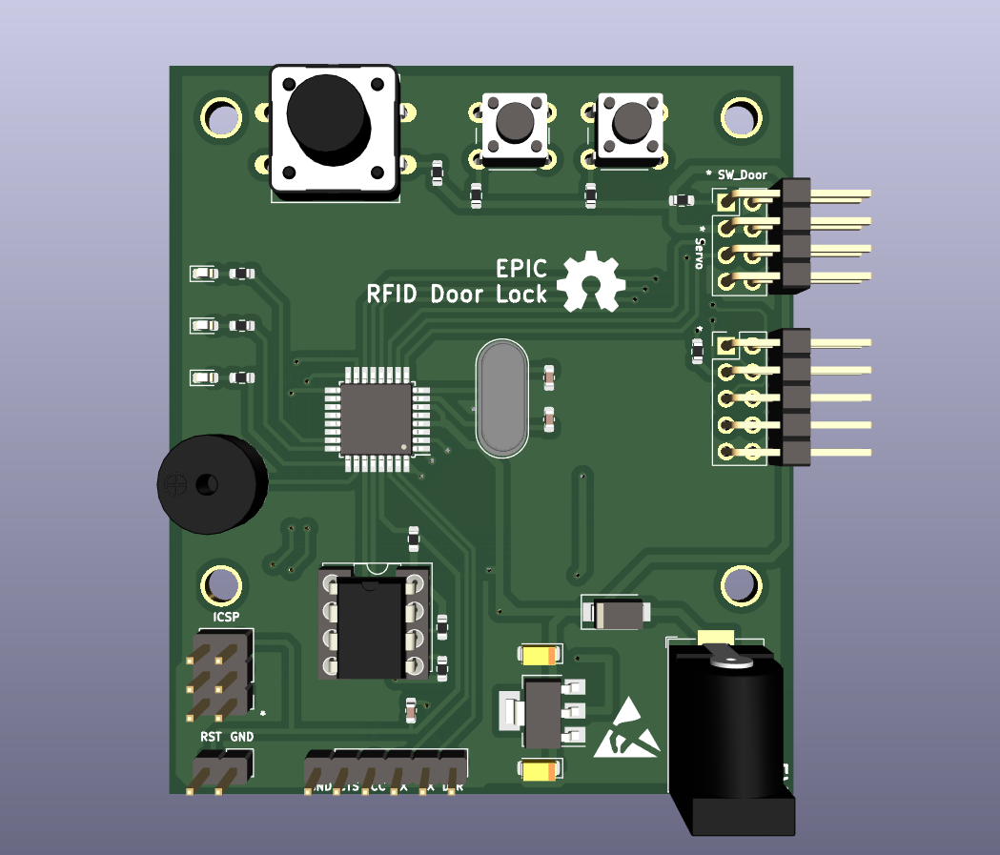

# EPIC Door Lock Project



## 1. 프로젝트 소개

연초고등학교 EPIC 동아리(2021~2022) 에서 교내 학생들의 자발적인 탐구 활동을 장려하기 위해 진행한 프로젝트 입니다.<br>
하드웨어 설계는 [KiCAD](https://www.kicad.org/) 를 사용하였고, 소프트웨어는 avr-gcc 컴파일러를 이용한 avr C 언어로 작성되었습니다.

<br>


## 2. 컴파일

Makefile을 이용하여 컴파일하는 경우, Makefile과 같은 위치에 `out` 폴더를 생성해야 합니다.

| 필요한 패키지 | 설명               |
| :-----------: | :----------------- |
|    avr-gcc    | 컴파일러           |
|   avr-libc    | 라이브러리         |
|   avr-size    | 메모리 사용량 확인 |
|    avrdude    | 업로더             |

<br>

### 1. in Linux

1. Set up (Debian)
    <br>
    패키지 설치는 Debian 기준으로 설명하고 있습니다. 자신의 환경에 맞추어 사용하시길 바랍니다.
    <br>

    ```console
    apt update && apt upgrade
    apt install avr-gcc avr-libc avr-size avrdude
    ```
    <br>

2. Download source code
    <br>
    ```console
    git clone https://github.com/leecurrent04/Epic_DoorLock
    cd ./Epic_DoorLock/ver3/code/avr/
    ```
    <br>

3. Set admin card
    <br>
    [main.c](https://github.com/leecurrent04/Epic_DoorLock/blob/main/ver3/code/avr/main.c) 파일의 16, 17줄을 편집하여 관리자 카드를 등록합니다.<br>
    RFID 카드의 4byte UID 코드를 1byte씩 기입합니다. 카드의 UID 코드는 [[NFC Tools - Google Play]](https://play.google.com/store/apps/details?id=com.wakdev.wdnfc&hl=en) 프로그램을 통하여 알 수 있습니다. (프로그램내 시리얼 번호 확인)<br>
    반드시 등록한 관리자 카드의 갯수에 맞게 `cardAdmin_Num` 값을 변경해주어야 합니다.
    <br>
    ```c
    #define cardAdmin_Num 2
    uint8_t cardAdmin_UID[cardAdmin_Num][4] = {
            {0x12, 0x34, 0x56, 0x78},
            {0x0A, 0x0B, 0x0C, 0x0D}
    };
    ```
    <br>

4. Complile
    <br>
    변경 사항을 저장한 후 아래 명령어를 이용하여 코드를 컴파일 합니다.
    <br>
    ```console
    mkdir out
    make all
    ```
    <br>또는 다음과 같은 명령어를 사용할 수 있습니다.<br>

    ```console
	avr-gcc -Wall -mmcu=atmega168p -Os main.c ./lib/* -o ./out/output.o
	avr-objcopy -j .text -j .data -O ihex ./out/output.o ./out/main.hex
    ```
    <br>

5. Upload
    <br>
    [Makefile](https://github.com/leecurrent04/Epic_DoorLock/blob/main/ver3/code/avr/Makefile) 의 2, 4, 5번째 줄을 환경에 맞게 편집합니다.<br>

    ```makefile
    PORT=/dev/ttyUSB0       # SET YOUR PORT
    OBJ_FILES=./lib/*
    BaudRate=115200         # SET BuadRate
    PROGRAMMER=arduino      # SET Programmer
    ```

    <br>아래의 명령어를 터미널에 입력하여 업로드 합니다.<br>

    ```console
    make flash
    ```


    <br>USBtinyISP를 사용하는 경우(권장), 다음의 명령어를 터미널에 입력하면 됩니다.<br>

    ```console
	avrdude -v -p m168p -c usbtiny -U flash:w:./out/main.hex:i
    ```

    <br><br>

### 2. Windows & Mac

[Microchip AVR GCC Compiler](https://www.microchip.com/en-us/tools-resources/develop/microchip-studio/gcc-compilers) 를 사용하여 Linux와 같은 과정을 따르거나, ATMEL Studio를 사용하십시오. <br>
자세한 과정은 『아트멜 스튜디오와 아두이노로 배우는 ATmega328 프로그래밍(허경용)』 도서를 참고하십시오.<br>
(이 프로젝트는 ATmega168p을 사용하였으므로, 업로드 과정에서 유의)
<br><br>


## 4. 참고 라이브러리

RFID 관련 AVR 라이브러리 : https://github.com/asif-mahmud/MIFARE-RFID-with-AVR


